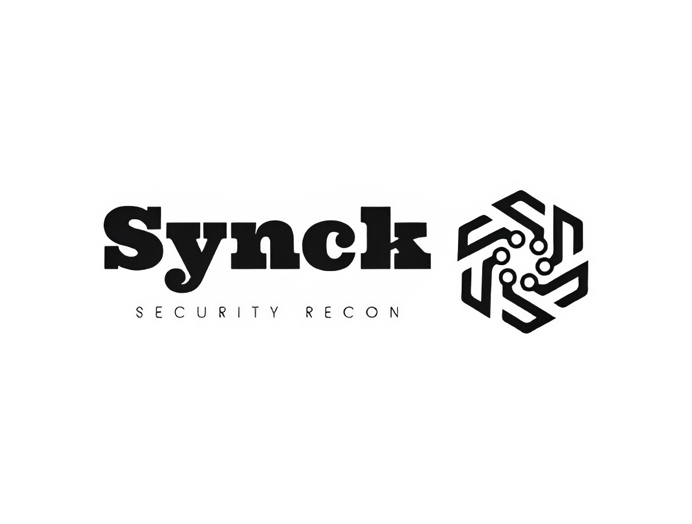

<p align="center">
  
</p>
<div align="center" style="line-height: 1;">

  <h2 style="margin: 0; font-weight: bold;">
    Red Team | Bug Bounty Hunter | DevSecOps
  </h2>

  

</div>


---

## 🧠 About Me

```
┌──(synck㉿redteam)-[~]
└─$ whoami
synck

┌──(synck㉿redteam)-[~]
└─$ info

Passionate about technology and hacking since a young age, I found my focus in cybersecurity.
Specialized in ethical hacking, penetration testing, and red team operations, I am constantly evolving to face current challenges.
My goal is to contribute to a safer and more innovative digital world. Connect with me to interact!

┌──(synck㉿redteam)-[~]
└─$ interests

Offensive Security | Pentest | Bug Bounty | DevSecOps | Reverse Engineering
```

---

## ⚙️ Tech Arsenal

```
┌──(synck㉿redteam)-[~]
└─$ tools

🔧 My tool
smartrecon 👉 github.com/Synck1/smartrecon

💻 Languages:
python | bash | go | JavaScript 
```
---

## 🌐 Connect with me

<p align="center">
  <a href="https://www.linkedin.com/in/rafael-soares-martins-330b8b1a1/" target="_blank">
    
  </a>
  
  <a href="https://hackerone.com/synck" target="_blank">
    
  </a>
</p>

---

## ⚠️ Disclaimer

```diff
+ 🚨 This repository and content are for educational and ethical purposes only.
- ❌ Unauthorized attacks are illegal.
+ 🧠 Hack the planet, but hack it ethically.
```

---

<p align="center">
  <b>Stay curious. Stay sharp. Keep hacking.</b>
</p>
